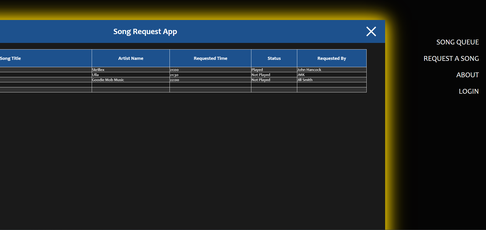

# Final App for MSSE661 - Regis University
## Live Song Requests App

### Purpose

This app is designed for DJs who interact with their audience by taking live song requests during events. It aims to streamline the request process and provide a dynamic experience for both DJs and users.

### Features 

1. User Form Submission
    - Users can submit song requests through a simple form.
    - The form collects information such as artist name and song title.

2. Song Request List
    - DJ and users can view a list of song requests in real-time. 
    - Each request displays details like artist, song title, and submission status (not played, played).
    - Requests are ordered based on the time of submission with a unique ID, providing a clear queue for the DJ to follow. 
 
3. Optional User Accounts
    - Users have the option to create accounts. 
    - Account features include storing user information (name, email) and keeping track of past song requests. 

### Implementation

- Backend: Utilizing Express and MySQL for data storage and retrieval.
- Frontend: HTML, CSS, and JavaScript for creating an intuitive user interface.

### Target Audience 

- DJs hosting events where audience interaction through song requests is a key feature.
- Users who want to engage with DJs and influence the event's music selection.

## Screenshots

### Index

### Sidebar Menu 

### Request Form

